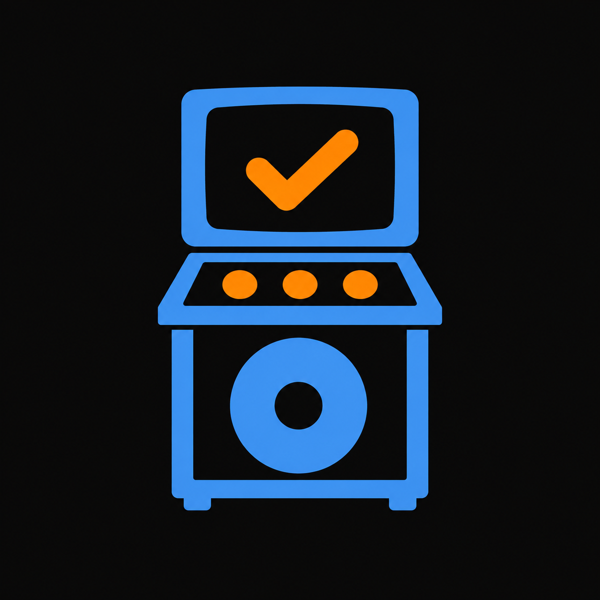

<div align="center">



<h1>KaraOK</h1>

<p><strong>Record. Assess. Compare.</strong></p>
<p>Understand your karaoke audio with five-feature quality assessments,<br>visual reports, and side-by-side comparisons.</p>

<p>
  <a href="https://github.com/jbl2023-2879-91296-cpu/KaraOK/releases"></a>
  
  
  
  
</p>

<p>
  <a href="https://github.com/jbl2023-2879-91296-cpu/KaraOK/releases"><strong>Releases</strong></a> &middot;
  <a href="#quick-start">Quick start</a> &middot;
  <a href="build.md">Build Android</a> &middot;
  <a href="deploy.md">Deploy backend</a> &middot;
  <a href="CHANGELOG.md">Changelog</a>
</p>

<p><sub>Loudness &middot; Bass &middot; Treble &middot; Sharpness &middot; Flatness</sub></p>

</div>

---

KaraOK is a Flutter application for evaluating karaoke audio quality. A Flask
API analyzes uploaded or recorded audio, grades five empirical features, stores
authenticated-user history in MySQL, and produces real Matplotlib waveform and
spectrogram reports.

## Latest updates - backend modularization (2026-09-26)

- Extracted feature implementations from `karaok/application.py` into shared
  core, authentication, user profiles, audio pipeline, results, administration,
  and system packages. Existing endpoints, public function signatures, and
  legacy `import app` callers remain supported.
- Application composition now handles Flask setup, request hooks, error
  handlers, and Blueprint registration. Existing `modules/` routes delegate
  to the packages that own their implementations.
- Backend MySQL connections now use UTC sessions, fixing the eight-hour shift
  in saved-record timestamps on phones in UTC+8. Existing records and the
  database schema require no rewrite for this fix or the modularization.
- Validation on 26 September: **264 backend tests passed**, including the
  opt-in live MySQL timestamp regression. A connected Android phone was tested
  against local MySQL for login, audio upload and scoring, visualizations,
  recommendations, saved history, and session restoration.

See [Backend modules](#backend-modules) below and the
[backend guide](backend/README.md) for package boundaries and test instructions.

### Previous updates - v1.1.0 (2026-09-18)

- New audio assessments use the median-centered quality profile
  `2026.09.2-median` for loudness, bass, treble, sharpness, and flatness.
  Each Good band is centered on its prior Good-class median, with its width
  preserved and equally wide improvement bands on either side.
- The backend retains the original 30-recording statistics and historical
  assessment scores. Profile versions and checksums identify the thresholds
  used for new assessments; feature weights and overall grade cutoffs are unchanged.
- Android builds now prompt for application name, package ID, version, build
  number, APK/AAB format, and release/debug/profile mode. Defaults and command-line
  options support both guided and automated builds.
- Startup widget tests account for the 1.5-second launch screen. Deployment
  instructions distinguish Windows PowerShell checks from Ubuntu server commands.
- Validation for the threshold update: 249 backend tests and seven affected
  Flutter metadata/contract tests passed.

The local signed Android package built on 18 September is **1.1.0+2**.
Build-time version overrides can differ from `frontend/pubspec.yaml`; check the
packaged `build-manifest.json` for the version and checksum of a specific APK.

### Comparison, reports, and branding

- Records supports selecting exactly two saved test instances for comparison.
  Selection follows each instance through sorting, including identical filenames;
  Cancel clears it. Comparison displays saved values and B minus A differences,
  supports swapping A/B, and labels missing measurements unavailable.
- Reports include expandable explanations of the five measurements. Recording
  screens include an optional consistency checklist with no invented calibration
  settings. Progress says uploading and analyzing because the API combines them;
  timeout guidance recommends checking Records before retrying.
- The Android launcher uses the selected blue karaoke cabinet and orange checkmark.
  Source artwork: `frontend/assets/branding/karaok-icon.png`.
- Startup shows a gently pulsing logo for at least 1.5 seconds after the first
  Flutter frame and waits longer when session restoration needs it. Reduced-motion
  settings disable the pulse. Startup errors retain Retry and Continue as Guest.
  Returning to an already-running app does not replay this animation.
- Report export/sharing remains excluded.

See [frontend usage and validation](frontend/README.md), the
[active assessment profile](backend/audio_thresholds/README.md), and the
[original empirical scoring report](docs/empirical-scoring-report.md).

## Audio quality assessment

The active artifact is
[`median_centered_thresholds.json`](backend/audio_thresholds/median_centered_thresholds.json).
It separates configured assessment boundaries from measured dataset statistics.
Scores are 100 at each fixed median, 80 at Good-band boundaries, and 50 at the
outer improvement boundaries, with linear interpolation and scores limited to
0-100. Overall grades use the existing weighted score: Good at 80 or above,
Needs improvement from 50 to below 80, and Bad below 50.

These symmetric thresholds are provisional engineering choices based on the
existing 30-recording reference, not independently validated listener ratings.
Some mathematical bands extend outside physical measurement limits. Additional
recordings and independent quality labels are needed to validate those boundaries.
See the [profile documentation](backend/audio_thresholds/README.md) for exact
values, domain limitations, generation, and legacy-profile support.

For an existing deployment, this threshold update requires the updated backend,
passing backend tests, an API restart, and health checks. It requires no database
rebuild or new APK. Existing saved assessments retain their original scores.

## Current application flow

- The app securely restores a valid saved login at startup; otherwise it opens
  directly in guest mode.
- Guests receive three successful audio evaluations on the device.
- Signed-in users can log in with either their username or verified email.
- Login remembers only the last successful email address and never stores the
  password.
- Public registration creates only regular `user` accounts.
- Home, Records, and Settings are persistent bottom-navigation destinations.
- Settings allows profile editing while keeping the email address read-only.
- Profile images can be taken with the camera or selected from the gallery, up
  to 5 MB in common phone-image formats.
- Signed-in analysis history and visual-report images are cached per user in
  app-private storage, then refreshed from the server when appropriate.
- Guest assessments and visual reports remain device-local. Signing in or
  creating an account does not transfer or assign guest records to that account.
- Completed results include a score, feature grading, noise and distortion
  measurements, and generated waveform and spectrogram reports.
- Results and visual reports use the same saved score, grade, and reference
  metadata. Noise and distortion are explicitly labeled as advisory estimates.
- Records support name search, inclusive date-range and numeric score filters,
  status filtering, and chronological newest/oldest sorting.
- A local-only KaraOK Admin Console provides analytics, schema visibility, and
  policy-controlled record management through the live Data Administration API.

## Adjusted amplifier settings

The quality-report source remains the existing 30-recording dataset in
`results/`; its active classification boundaries now come from the median-centered
profile above. The [original report reference audit](docs/report-reference-audit.md)
documents the source verification and measured ranges.

KaraOK records or accepts rendered karaoke instrumental playback, measures five audio features, and recommends bounded positions for Volume, Bass, Treble, Sharpness, and Flatness. It does not analyze a singer, vocal track, feedback, or microphone effects, and it does not parse symbolic .mid files.

The user selects a supported genre and the amplifier's `0-10`, `0-100`, or
custom printed scale. They can enter all five real positions or choose the
optional **Use researched starting point** action. That action converts the
versioned `40/50/50/50/50` normalized prior to the physical scale, but it is a
provisional starting point rather than a verified optimum. The user must
physically match all five controls and confirm that action before continuing.

KaraOK evaluates the recorded playback with the versioned quality artifact and
compares the same five measurements with the selected genre artifact. It shows
all five bounded recommendations and never controls the amplifier. After the
user physically applies them, **Record Again to Verify** measures a second
rendered-instrumental recording. Keep the room, phone position relative to the
speakers, playback level, source, and song section unchanged between recordings.

The current Rock, Pop, and Hip-Hop profiles each contain only five licensed FMA
recordings whose instrumental status is unverified. Their confidence is
therefore low, and their targets remain provisional until regenerated from a
larger, genre-representative instrumental or rendered-MIDI corpus. Results also
depend on the amplifier, loudspeakers, room, playback level, and phone placement.

The settings metadata exposes the genre profile version/checksum, quality
profile version/checksum, and control-prior version/checksum. The source dataset
or manifest checksum, generator or algorithm version, licenses, assumptions,
and canonical artifact checksums are documented in
[`docs/settings-profile-sources.md`](docs/settings-profile-sources.md).

The backend feature flag `SETTINGS_RECOMMENDATIONS_ENABLED` defaults to `false`.
Fresh or disposable environments must be built from the consolidated
`database/schema.sql`, and operators must pass the controlled-trial gate before
enabling the feature outside an approved staging environment. Disabling the
flag stops new generation and hides the settings endpoints without deleting
stored profiles, assessments, or recommendations.

## Technology

| Layer          | Technology                                |
| -------------- | ----------------------------------------- |
| Client         | Flutter and Dart                          |
| API            | Python, Flask, JWT, Argon2id              |
| Audio analysis | Librosa, NumPy, SciPy, Matplotlib, Pandas |
| Database       | MySQL                                     |
| Administration | Local PHP 8.2, Tailwind CSS, Flask HTTPS API |
| Production     | Gunicorn, Nginx, systemd                  |

## Repository layout

```text
KaraOK/
|-- backend/          Flask API, analyzer, thresholds, and tests
|-- admin/            Local Admin Console and its ignored operating guide
|-- frontend/         Flutter application and widget tests
|-- database/         Fresh-install schema and compatibility migration documentation
|-- deploy/ovh/       Production service and web-server configuration
|-- tools/            Development/build commands, shared helpers, and script tests
|-- docs/             Calibration sources and design history
|-- build.md          Android signing, builds, and artifact packaging
|-- deploy.md         Backend release and recovery runbook
|-- CHANGELOG.md      User-visible implementation history
`-- README.md         Public project documentation
```

## Backend modules

`backend/app.py` remains the compatibility entry point;
`backend/karaok/application.py` composes the Flask application. The extracted
packages live under `backend/karaok/`:

| Package | Responsibility |
| --- | --- |
| `core/` | Shared configuration, database connections, validation, models, account helpers, scoring and threshold loaders, audit writing, and artifact paths |
| `auth/` | Registration, login, token issuance and refresh, password changes, email delivery, and access checks |
| `users/` | User profile updates |
| `audio_pipeline/` | Upload validation and orchestration, analyzer execution, feature summaries, quality evaluation, recommendations, and transient visualizations |
| `results/` | Assessment and upload persistence, saved history, amplifier profiles, saved recommendations, and stored visualization retrieval |
| `admin/` | Administrative user and log queries; `data/` contains data policies, operations, and reports |
| `system/` | API and database health checks |
| `modules/` | Existing Flask Blueprints and route paths, delegating to the owning packages |

The dependency rules keep shared code below feature code:

- `core/` does not import the feature packages.
- Code outside `audio_pipeline/` uses its public `pipeline.py` interface rather
  than importing individual processing stages.
- Results persistence receives prepared analysis summaries. Results do not
  call back into the audio pipeline to rerun analysis; visualization endpoints
  serve saved artifacts.

The numerical feature-extraction engine remains in `backend/audio_engine/`,
invoked through `audio_analyzer.py`. Bounded amplifier adjustments remain in
`backend/settings_recommendations/engine.py`, and versioned threshold and genre
artifacts remain in `backend/audio_thresholds/`. Genre-based recommendations
use the user's selected genre; this refactor does not add automatic genre
detection. System settings remain configuration rather than a new settings API.

`legacy_exports.py` and `compatibility.py` preserve historical imports and
dependency overrides used by existing callers and tests. New implementations
should import the owning package directly. Older `common/`, `infrastructure/`,
and `security/` paths remain for compatibility. See the
[backend package guide](backend/README.md#package-layout) for details.

## Prerequisites

- Flutter with Dart `3.12.2` or later in the supported SDK range
- Python `3.13` and `venv`
- MySQL 8.x
- FFmpeg and libsndfile for supported audio decoding

## Quick start

### 1. Create the database

Import the authoritative fresh-install schema into an empty MySQL instance:

```powershell
mysql -u root -p --execute="source database/schema.sql"
```

### 2. Run the API

```powershell
cd backend
python -m venv .venv
.\.venv\Scripts\python.exe -m pip install -r requirements.txt
Copy-Item .env.example .env
```

Edit `backend/.env` with local database, JWT, SMTP, CORS, and storage values.
Never commit that file. Then start the API:

```powershell
.\.venv\Scripts\python.exe run.py
```

The default health endpoint is `http://127.0.0.1:5000/api/health`.

### 3. Run the local Admin Console

The Admin Console calls the backend Data Administration API over HTTPS and
does not connect directly to MySQL or require an SSH tunnel. Its one-time
backend account, API-key, deployment, and local startup instructions are in
the ignored `admin/README.md`.

```powershell
cd admin
composer install
npm install
npm run css:build
composer test
composer serve
```

Open `http://127.0.0.1:8080/login`.

### 4. Run Flutter

```powershell
cd frontend
flutter pub get
flutter run --dart-define=API_BASE_URL=http://127.0.0.1:5000/api
```

For an Android emulator, use `http://10.0.2.2:5000/api` instead of localhost.

## Tooling and release guides

Start the interactive Android build from the repository root in PowerShell:

```powershell
./tools/build_karaok.ps1
```

Press Enter to accept defaults, including app name `KaraOK`, package ID
`com.jrpbone.karaok`, and version/build from `frontend/pubspec.yaml`. Format
(`apk` or `aab`) and mode (`release`, `debug`, or `profile`) are separate choices.
Use `-NonInteractive` for automation or `-PlanOnly` to preview the configuration.
Builds apply the selected identity and version without rewriting project defaults.

See [tools](tools/README.md), [Android builds](build.md), [database setup](database/README.md),
and [deployment](deploy.md). Main commands stay at `tools/`; shared helpers live
in `tools/lib/`, secret generation in `tools/security/`, and regressions in `tools/tests/`.

## Testing

On the Windows development computer, run all repository release groups from the
root in PowerShell (backend, Flutter, analysis, and PowerShell):

```powershell
./tools/run-affected-tests.ps1 -All
```

Use `-ListOnly` to preview groups or omit `-All` for checks selected from working-tree changes.
The Admin Console suite and real-service integration are separate, explicit checks.
On Ubuntu production servers, use the service-account backend commands in
[deployment step 7b](deploy.md#7b-ubuntu-vps---bash).

Run the lightweight client checks:

```powershell
cd frontend
flutter analyze
flutter test
```

Run the backend suite:

```powershell
cd backend
.\.venv\Scripts\python.exe -m unittest discover -s tests -p "test_*.py" -v
```

Run the local Admin Console suite:

```powershell
cd admin
composer test
```

## Security and publication

- Passwords use Argon2id hashes.
- User-chosen passwords accept 8-128 characters; generated temporary passwords
  are eight characters. Both require an uppercase letter, lowercase letter,
  number, and symbol.
- OTPs and tokens are never stored in plaintext.
- Access and refresh tokens are stored through platform-secure storage; app
  startup uses the refresh token to restore the authoritative server profile.
- Uploaded audio is temporary and deleted after processing.
- Saved visualizations are served only after assessment ownership checks.
- Locally cached history and visualization files are isolated by user and
  cleared on explicit logout, password replacement, or assessment deletion.
- Completed guest reports and their two plots remain in app-private device
  storage across restarts. Android backup/transfer is disabled, so uninstalling
  the app permanently removes those files instead of restoring them later.
- Guest reports remain separate from authenticated account history. Creating an
  account or signing in does not upload, claim, or reassign those local reports.
- Data Administration API requests require a high-entropy machine key, use an
  independently revocable MySQL identity, and enforce explicit per-table CRUD
  capabilities without accepting arbitrary SQL or schema changes.
- API errors are returned as JSON.
- Secrets belong only in ignored environment files or a production secret
  manager. No real credentials should appear in this public README.

This repository does not currently declare an open-source license. Unless a
license is added, normal copyright restrictions apply.
